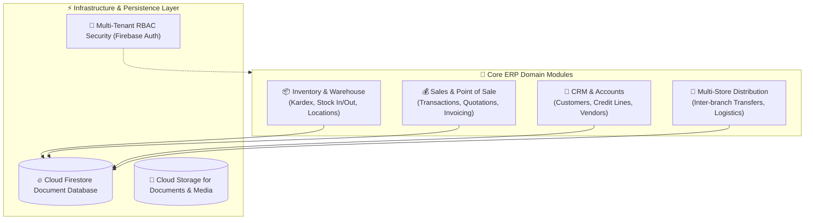

# 🏢 MERPSI (Multi-Tenant ERP Domain Architecture Case Study)

[](https://angular.io)
[](https://firebase.google.com)
[](https://github.com/jgu7man/merpsi)
[](LICENSE)

An architectural case study and reference implementation of a **multi-tenant Enterprise Resource Planning (ERP) platform** designed for wholesale distribution, multi-store inventory routing, sales management, and operational governance.

---

## 🏛️ Domain Architecture Breakdown



---

## 💡 Key Architectural Decisions & Takeaways

1. **Multi-Tenant Partitioning:** Evaluated data partitioning strategies to isolate company tenant data while maintaining centralized product master catalogs.
2. **Kardex Consistency:** Built atomic transaction patterns to ensure concurrent point-of-sale checkouts never produce negative stock anomalies.
3. **Decoupled Business Rules:** Separated financial calculation rules from Angular UI views for long-term maintainability.

---

## 🚀 Development Setup

1. **Clone the repository and install dependencies:**
   ```bash
   git clone https://github.com/jgu7man/merpsi.git
   cd merpsi
   npm install
   ```

2. **Configure Firebase Credentials:**
   Set up your project credentials in `src/environments/environment.ts` and `src/environments/environment.prod.ts`:
   ```typescript
   export const environment = {
     production: false,
     firebaseConfig: {
       apiKey: "AIza***********************************",
       authDomain: "merpsi.firebaseapp.com",
       projectId: "merpsi",
       storageBucket: "merpsi.appspot.com",
       messagingSenderId: "************",
       appId: "1:************************************",
       measurementId: "G-**********"
     }
   };
   ```

3. **Start the local development server:**
   ```bash
   ng serve
   ```
   Open your browser at `http://localhost:4200/`.

---

## 📄 License

Distributed under the [MIT License](LICENSE). Created by [Jorge Guzmán (@jgu7man)](https://github.com/jgu7man).
